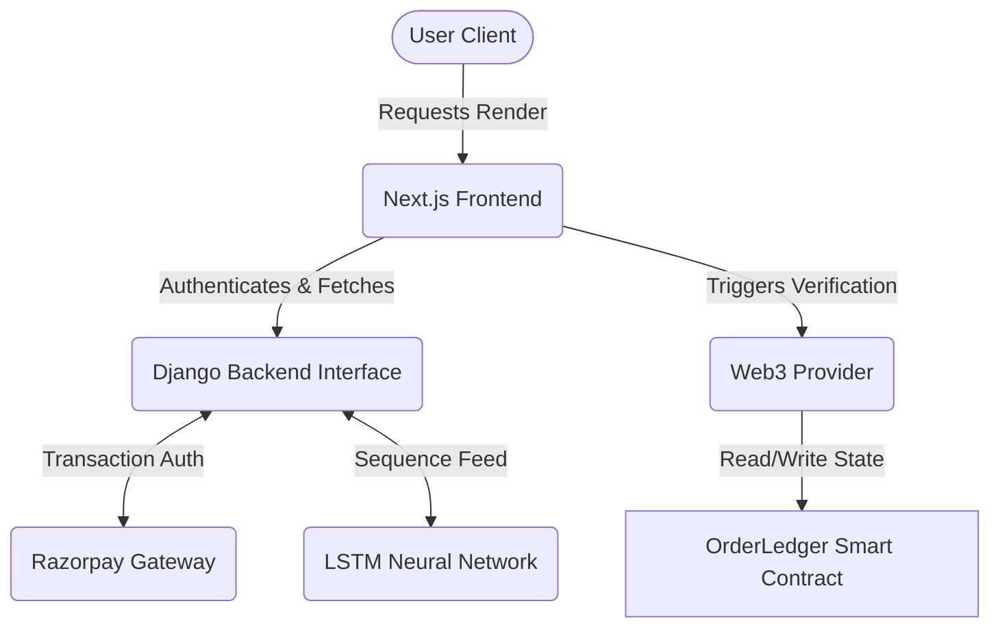

<div align="center">

# NexCart AI 🛒✨
**Predictive E-Commerce Architecture Powered by Deep Learning & Web3**


*An advanced fusion of modern front-end design, secure decentralized ledger systems, and predictive neural networks.*

</div>

---

## 📖 Introduction
**NexCart AI** is a next-generation experimental e-commerce architecture designed to bridge the gap between traditional retail platforms and futuristic technological frameworks. Built completely from the ground up, this ecosystem abandons standard methodologies in favor of real-time Long Short-Term Memory (LSTM) machine learning inferences and an immutable blockchain ledger to track high-value procurements. 

Developed entirely by **Atharva Lotankar**, NexCart AI stands as a showcase of combining diverse, cutting-edge technologies into one flawless, operational hub.

---

## 🚀 Fast-Track Setup (Post-Clone)

Immediately after cloning, run these commands in order to initialize the entire NexCart ecosystem correctly. These steps are optimized for **Windows** environments.

### 1. 🏗️ Global Initialization
Prepare all environment files (duplicate templates to active configs):
```bash
# From the project root:
copy frontend\.env.example frontend\.env.local
copy backend\.env.example backend\.env
copy blockchain\.env.example blockchain\.env
```
> [!IMPORTANT]
> Ensure you have **PostgreSQL** running and create a database named `nexcart_db` manually before proceeding.

### 2. 🐉 Backend & Neural Engine (Django + LSTM)
This initializes the database, seeds products, and syncs the ML model mappings.
```bash
cd backend
python -m venv venv
venv\Scripts\activate
pip install -r requirements.txt

# Database Setup & Seeding
python manage.py migrate
python seed_data.py        # Populates the marketplace with 90+ products
python update_mappings.py  # Syncs ML indices with live Database IDs
python manage.py runserver
```

### 3. 🎨 Visual Matrix (Next.js Frontend)
```bash
cd ../frontend
npm install
npm run dev
```

### 4. ⛓️ Decentralized Ledger (Hardhat)
```bash
cd ../blockchain
npm install
npx hardhat compile
```

---

## 📚 Deep Dive Documentation

Explore each layer of the NexCart ecosystem through dedicated architectural guides:

| Layer | Purpose | Documentation |
|:------|:--------|:--------------|
| 🎨 **Frontend** | Interactive client interface | [→ Frontend Guide](./frontend/) |
| 🧠 **Backend** | Central orchestration hub | [→ Backend Guide](./backend/) |
| ⛓️ **Blockchain** | Immutable order ledger | [→ Blockchain Guide](./blockchain/) |
| 🤖 **AI/ML** | Neural recommendation engine | [→ ML Model Guide](./ml-model/) |

Each guide provides layman-friendly explanations, technical architecture, metaphors, and hands-on commands.

---


## 🌌 System Architecture


The NexCart infrastructure elegantly delegates responsibilities across four primary quadrants:

### 1. The Interactive Matrix (Frontend UI/UX)
*The face of the platform. Designed with absolute graphical fidelity, glassmorphism, and seamless micro-animations.*
- **Framework:** Next.js (App Router), React
- **Styling Engine:** Tailwind CSS, Framer Motion
- **Telemetry Visualizations:** Recharts for dynamic visual Pulse Analytics.
- **Key Features:** Client-side cart caching, interactive AI trajectory charts, automated 1-page PDF cryptographically-styled receipts, dynamic responsive grid systems.

### 2. The Neural Core (Deep Learning Pattern Engine)
*A dedicated predictive machine learning tier utilizing time-series analysis.*
- **Technology:** TensorFlow, Keras, Pandas
- **Model:** Long Short-Term Memory (LSTM) RNN
- **Functionality:** Tracks procurement sequences over time and predicts future purchasing intervals and product affinities for personalized product "activation." 

### 3. The Central Hub (Backend API & Databases)
*The highly efficient relay coordinating data between the neural core, the front end, and external payment processors.*
- **Architecture:** Django REST Framework, Python
- **Payments:** Native API integration with Razorpay utilizing Server-to-Server callbacks and Webhook signature verification.
- **Auth:** JWT and localized session validation.

### 4. The Immutable Ledger (Web3 & Ethereum)
*Tamper-proof physical logistics tracking directly on the Ethereum network.*
- **Smart Contracts:** Solidity
- **Environment:** Hardhat, Ethers.js, Sepolia Testnet
- **Protocol:** Every order initiated on NexCart creates a cryptographic hash on-chain, storing its State (`Pending`, `Shipped`, `Arrived`) permanently and securely.

---

## 📊 Pulse Analytics Visual Mapping

NexCart doesn't just display numbers. By utilizing the *Pulse Analytics Modal*, order trajectories and historical financial impacts are visualized directly on top of LSTM predictions within the User Dashboard.

| Metric | Representation | Logic |
| :--- | :--- | :--- |
| **Real-time Trajectory** | Green Graph Spline | Calculates the direct sum volume of active purchases |
| **LSTM Prediction** | Blue Graph Spline | Time-series prediction mapped to future likelihood values |
| **Ledger Verification** | Hex Hash Link | Mapped directly from the Razorpay Gateway node to an EVM Smart Contract ID |

---

## ⚙️ Technical Workflow



---

## 🔗 Blockchain Synchronization Architecture

NexCart implements a sophisticated **dual-state synchronization system** ensuring Django database and Ethereum blockchain remain perpetually aligned, even across extended periods of inactivity.

### The Synchronization Challenge

Traditional e-commerce platforms store order states in centralized databases. NexCart elevates this by maintaining **parallel state** on an immutable blockchain ledger, creating cryptographic proof of order lifecycle transitions.

The challenge: Django updates happen instantly. Blockchain transactions require network confirmation. Async operations risk state divergence.

### The Solution: Synchronous Blockchain Commits

Every order status mutation in Django triggers an **immediate, blocking blockchain transaction** before the database commit completes. This guarantees atomic consistency across both persistence layers.

**Technical Implementation:**

```python
# Django Signal (api/signals.py)
@receiver(post_save, sender=Order)
def sync_order_status_to_ledger(sender, instance, created, **kwargs):
    # Step 1: Create order on blockchain (if new)
    # Step 2: Update status on blockchain (if changed)
    # Uses subprocess.run() - synchronous, not Popen
    # Waits for blockchain confirmation before proceeding
```

**Blockchain Scripts:**
- `createOrder.js` - Initializes order on Ethereum ledger
- `syncOrder.js` - Updates order status on blockchain

### Time-Based Status Transitions

Orders automatically progress through lifecycle stages based on elapsed time:

| Time Elapsed | Django Status | Blockchain Status | Trigger |
|:-------------|:--------------|:------------------|:--------|
| 0 - 1 min | Pending | 0 (Pending) | Payment verification |
| 1 min - 24h | Arriving Tomorrow | 1 (Shipped) | Automatic |
| 24h+ | Delivered | 2 (Arrived) | Automatic |

### The Temporal Synchronization Problem

**Scenario:** User places order in June. Closes project. Reopens in September.

**Without temporal sync:** Orders remain frozen in June state. Blockchain shows "Pending" despite months passing.

**With temporal sync:** On Django startup, all orders are evaluated against current time. Status auto-corrects to match elapsed duration. Blockchain syncs accordingly.

### Implementation: Startup Reconciliation

```python
# Django App Config (api/apps.py)
def ready(self):
    # Spawns background thread on Django initialization
    # Calculates correct status for all orders based on creation timestamp
    # Updates Django → Triggers signals → Syncs blockchain
    threading.Thread(target=update_orders_on_startup, daemon=True).start()
```

**Management Command (can be run manually):**
```bash
python manage.py update_order_statuses
```

This command:
1. Queries all non-terminal orders
2. Calculates time delta from creation
3. Applies status transition logic
4. Saves updated status (triggers blockchain sync via signal)

### Operational Guarantees

**Synchronous Commits:** Django waits for blockchain confirmation. No state drift.

**Temporal Reconciliation:** Orders self-correct on startup. Project dormancy irrelevant.

**Idempotent Operations:** Blockchain scripts handle "already exists" gracefully.

**Timeout Protection:** 60-second limit prevents hanging on network issues.

**Future-Proof:** Clone repo months later → Start Django → All states auto-correct.

### Recovery & Maintenance

**One-Time Bulk Sync (for existing orders):**
```bash
cd backend
python sync_all_orders_blockchain.py
```

**Periodic Status Check (optional automation):**
```bash
cd backend
update_orders.bat  # Windows Task Scheduler compatible
```

This architecture ensures cryptographic order integrity across arbitrary time gaps, making NexCart resilient to sporadic deployment patterns while maintaining decentralized proof-of-state.

---

## 🔒 Security Measures Configured
- `.gitignore` rigorously protects multiple layered `.env` topologies across Frontend, Backend, and Blockchain segments.
- Private Keys (Hardhat/Ethereum) secured out-of-bounds.
- Razorpay API secrets decoupled from the Client and strictly operated within the Django Django-Server limits.

---

<div align="center">

*Engineered by Atharva Lotankar. Powered by AI and Web3.*
<br>
**End of Project.**

</div>
