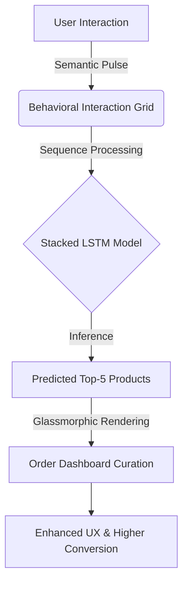

# NexCart: AI-Driven Sequential Recommendation System 🛒🧠

<p align="center">
  
</p>

<p align="center">
  <a href="https://github.com/NexCart/core">
    
  </a>
  <a href="https://github.com/NexCart/core/actions">
    
  </a>
  <a href="https://opensource.org/licenses/MIT">
    
  </a>
</p>

---

## 💎 The Premium E-Commerce Intelligence Hub

**NexCart** is not just an e-commerce platform; it's a high-fidelity ecosystem engineered with **Stacked LSTM Neural Networks**. It bridges the gap between traditional retail and personalized AI experiences through real-time behavioral telemetry and high-performance React architectures.

### 🌟 Key Orchestrations
- **Sequential Prediction Engine**: Utilizing Stacked LSTM to forecast the next 5 shopping candidates.
- **Glassmorphic UI Engine**: Next.js 15 powered interface with premium hover effects and smooth transitions.
- **Semantic Pulse Tracking**: Real-time logging of user interactions into a behavioral telemetry grid.
- **Enterprise-Grade Infrastructure**: Django REST framework combined with PostgreSQL for robust transactional stability.

---

## 🛠️ Technology Pulse

| Layer | Stack | Purpose |
| :--- | :--- | :--- |
| **Frontend** | `Next.js 15`, `Tailwind CSS`, `Framer Motion` | High-fidelity User Interface |
| **Backend** | `Django REST Framework`, `PostgreSQL` | Secure Transactional API |
| **Intelligence** | `TensorFlow`, `Keras`, `Stacked LSTM` | Sequential Pattern Recognition |
| **Payments** | `Razorpay`, `Webhooks` | Localized Financial Orchestration |
| **Analytics** | `Recharts`, `Behavioral Telemetry` | Real-time Data Visualization |

---

## 🎨 Premium UI Components & Design

NexCart features a selection of high-end UI components designed for visual excellence.

<div align="center">
  <h3>✨ Featured Components</h3>
  <br />
  <table>
    <tr>
      <td width="33%">
        
        <br />
        <p>Premium product cards with blurred glass effects and smooth hover states.</p>
      </td>
      <td width="33%">
        
        <br />
        <p>Real-time telemetry visualized via Recharts for instant user behavioral feedback.</p>
      </td>
      <td width="33%">
        
        <br />
        <p>Smooth scroll-reveal animations and interactive element transitions.</p>
      </td>
    </tr>
  </table>
</div>

---

## 🚀 Deployment Command Center

### 🔑 Prerequisites
- **Python 3.10+** (Backend & Neural Model)
- **Node.js 18+** (Frontend React Stack)
- **PostgreSQL** (Active instance `nexcart_db`)

### 🛰️ Fast-Track Launch

```bash
# 1. Backend Pulse
cd backend && python -m venv venv && source venv/bin/activate
pip install -r requirements.txt && python manage.py migrate
python manage.py runserver

# 2. Frontend Pulse
cd frontend && npm install && npm run dev

# 3. Neural Engine Activation
cd ml-model && python generate_synthetic_data.py
python preprocess_and_train.py
```

<div align="center">
  <br />
  <a href="#quick-start">
    
  </a>
  &nbsp;&nbsp;
  <a href="docs/tech_stack.md">
    
  </a>
</div>

---

## 🤖 Neural Workflow Architecture



### 🧠 Logic Pulse Overview
1. **Interaction Grid**: Every click and purchase is logged as a semantic pulse.
2. **Sequential Windowing**: System extracts the last 10 interactions once user passes 5 orders.
3. **Inference Loop**: The Keras model predicts the next likely sequence of products.
4. **Curation**: High-fidelity Glassmorphic cards surface the predictions on the User Dashboard.

---

## 🛡️ Security & Integrity
- **JWT Identity Pulse**: Secure JSON Web Token authentication with cookie persistence.
- **Telemetry Guard**: Anonymized user interaction data for AI processing.
- **Financial Encryption**: End-to-end Razorpay integration for secure localized payments.

---

<p align="center">
  Built with ❤️ for the future of localized AI-Commerce.
  <br />
  <b>NexCart Team © 2026</b>
</p>
